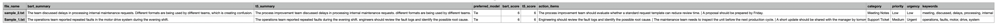

# LLM-Based Document Intelligence System

## Overview

This project focuses on building a simple document intelligence pipeline using Large Language Models (LLMs).

The idea is to take unstructured text (like reports or tickets) and convert it into structured information such as summaries, action items, and other useful details.

---

## What I did in this project

* Built a pipeline to process multiple text documents
* Used Hugging Face models for summarization
* Compared two models: **BART and T5**
* Created a small evaluation system to compare outputs
* Extracted action items and keywords using NLP
* Generated structured outputs in JSON and CSV

---

## Workflow

```
Input Text → Summarization → NLP Processing → Evaluation → Output
```

---

## Model Comparison

I used two models:

* **BART** → gives more clean and structured summaries
* **T5** → sometimes gives longer outputs but formatting is less consistent

To compare them, I used:

* sentence quality
* formatting
* readability

---

## Results and Observations

* BART summaries were generally cleaner and easier to read
* T5 sometimes produced longer outputs but less structured
* In some cases both models performed similarly (tie)
* The evaluation step helped in deciding which output is better

---

## Example Output

### JSON Output (Model Comparison)

This shows how both models are compared and evaluated:



---

### CSV Output (Structured Results)

This shows combined results for all documents in a table format:


---

## Tech Stack

* Python
* Hugging Face Transformers
* Pandas
* Basic NLP (regex, text processing)

---

## How to run

```
python3 -m venv .venv
source .venv/bin/activate
pip install -r requirements.txt
python3 src/main.py
```

---

## Why this project is useful

This type of system can help in real-world scenarios like:

* processing support tickets
* analyzing reports
* extracting actions from meeting notes

It reduces manual effort and helps organize information.

---

## Author

Keerthija
M.Eng. Information Technology (Specialization: Artificial Intelligence)
