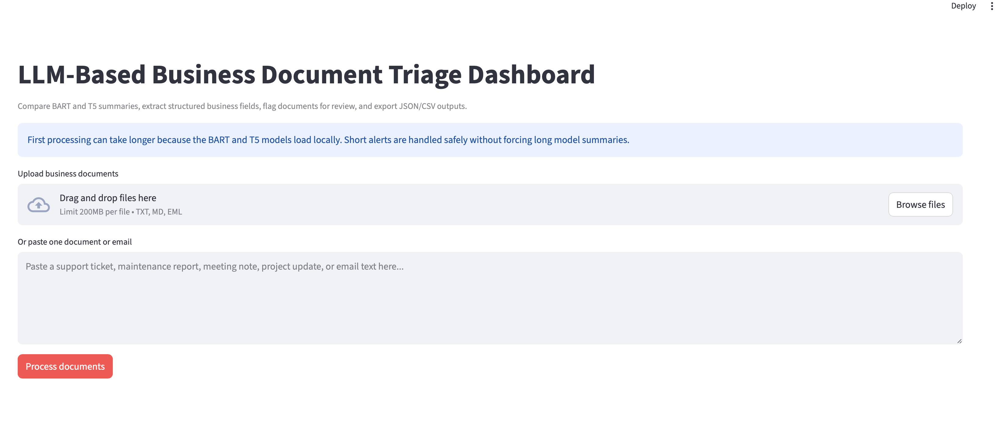
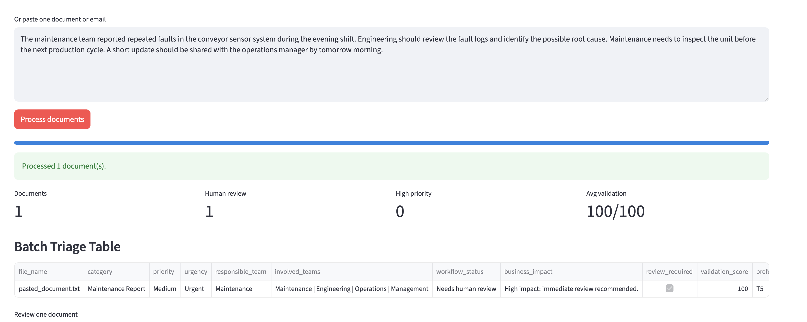
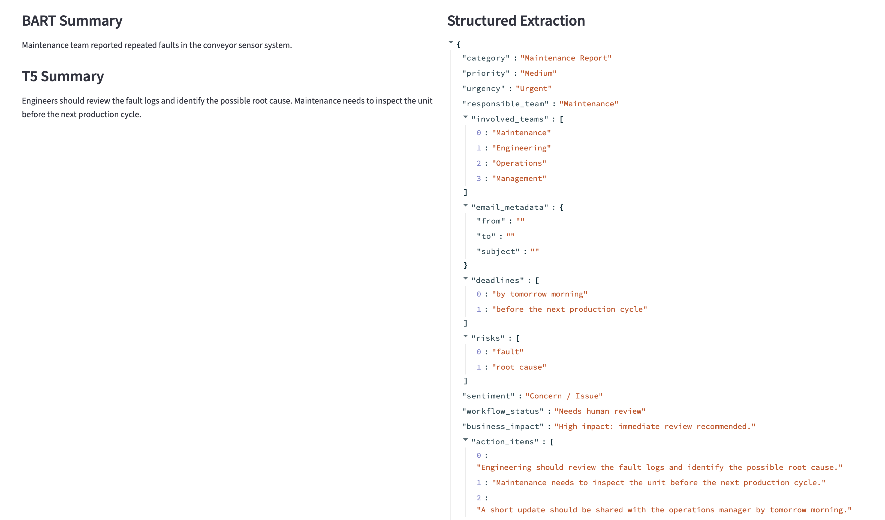
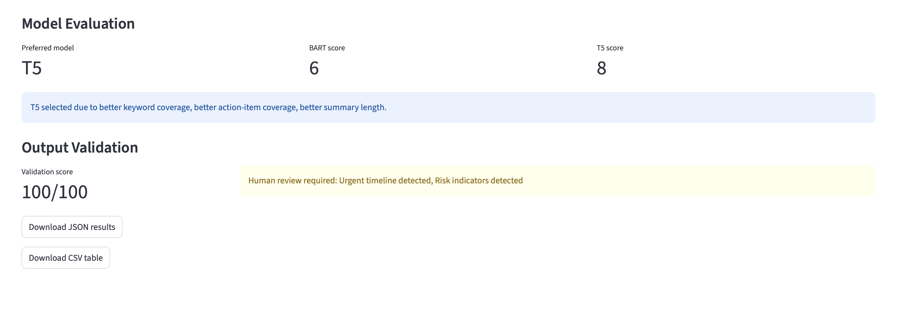

# LLM-Based Business Document Triage Dashboard

This project is a practical document triage prototype for turning unstructured business text into reviewable structured outputs. It compares BART and T5 summaries, classifies incoming documents or emails, extracts action items and business fields, flags documents that need human review, and exports results as JSON or CSV.

I built this project because many messages are easy to read one by one, but hard to manage as a queue. A maintenance note, customer complaint, meeting update, job alert, or rejection email may all need different handling. Instead of only generating a summary, the system tries to answer practical questions such as:

- What type of document is this?
- Is it urgent or high priority?
- Which team or workflow should handle it?
- Are there risks, deadlines, or action items?
- Which model output is more useful?
- Does the extracted output need human review?

The goal is not to replace a person. The goal is to create a first-pass triage layer that makes messy text easier to review, route, and export.

I later added a small queue-monitoring layer because I noticed that triage is not only about one document. In a real workflow, I would also need to know whether a document was already processed, how confident the routing decision was, why something was sent for review, how long processing took, and which items should be checked first.

## Features

- Streamlit dashboard for processing pasted text or uploaded `.txt`, `.md`, and `.eml` files
- BART and T5 summarisation using Hugging Face Transformers
- Model comparison using summary quality, keyword coverage, action-item coverage, repetition, and length checks
- Classification of business and everyday communication types
- Structured extraction of priority, urgency, responsible team, involved teams, risks, deadlines, sentiment, and recommended next action
- Human-review flag for urgent, risky, unclear, or operationally important documents
- Processing IDs and document hashes for tracking processed items without storing the full text in the run log
- Duplicate detection inside a batch
- Routing confidence with visible evidence checks for category, team, priority, and review signals
- Review queue controls to filter only documents that need human review
- Category and responsible-team filters for checking larger batches more easily
- Queue scoring to bring urgent, uncertain, duplicate, or review-required items to the top
- Batch summary tables for category counts, team counts, and review reasons
- Local CSV run log for review status, validation score, routing confidence, and processing latency
- Output validation score for checking whether required structured fields are present
- Batch triage table for reviewing multiple documents
- JSON and CSV export for later review or reporting
- Small labeled evaluation set for checking category, routing, priority, urgency, action-item, and human-review logic

## Why Triage Matters

The important part of this project is the step after summarisation. A short summary is helpful, but a workflow usually needs structure:

- category
- priority and urgency
- responsible team
- risks and deadlines
- action items
- recommended next action
- human-review flag

That is why the dashboard combines model summaries with rule-based checks. The rule-based checks make the system easier to inspect and improve than a black-box answer alone.

## Structured Triage Evaluation

After testing the dashboard manually, I added a small labeled evaluation set to make the project less subjective. The evaluation checks whether the system routes different business and email examples correctly.

The current evaluation set contains 10 examples:

- maintenance fault report
- customer refund complaint
- meeting note with process issue
- job application rejection
- job alert
- interview invitation
- incident/outage report
- procurement invoice issue
- event ticket alert
- personal message

Latest local evaluation result:

```text
Cases tested: 10
Category accuracy: 100.0%
Priority accuracy: 100.0%
Urgency accuracy: 100.0%
Team routing accuracy: 100.0%
Review flag accuracy: 100.0%
Action-item detection: 100.0%
Average validation score: 100.0/100
```

This is not a large benchmark. I use it as a controlled regression check so that new rules do not accidentally break important categories like job rejections, incidents, maintenance reports, or procurement documents.

## Supported Document Types

The system handles several practical text categories:

- Maintenance reports
- Support tickets
- Customer complaints
- Meeting notes
- Project updates
- Incident reports
- Procurement documents
- Job alerts and career updates
- Job rejection emails
- Interview invitations
- Reminders and schedules
- Marketing or event alerts
- Personal messages

## Screenshots

### Upload and Paste Interface


### Batch Triage Table


### Structured Extraction


### Model Evaluation and Validation


## Example Workflow

```text
Input document or email
        |
BART and T5 summarisation
        |
Business category detection
        |
Priority, urgency, risks, deadlines, and team extraction
        |
Model output evaluation
        |
Human-review and validation checks
        |
Queue monitoring, filters, and review reasons
        |
JSON / CSV export
```

## Queue Monitoring

For each processed document, the dashboard now adds:

- a short processing ID
- a document hash for duplicate detection
- duplicate status
- routing confidence
- routing evidence checks
- a queue score for review ordering
- processing latency in milliseconds
- review-required status and review reasons

The batch table can also be filtered by:

- review-required documents only
- category
- responsible team

I added these controls because a triage tool should not only show results; it should also help decide what needs attention first. For example, a duplicate document, an urgent maintenance report, or a document with low routing confidence should be easier to notice than a normal low-priority message.

The local run log is saved to:

```text
data/output/triage_run_log.csv
```

I added this because a triage tool should be easy to audit. If the system routes a document incorrectly, the log gives me a simple way to check what category, team, priority, validation score, routing confidence, and review flag were produced during that run. The log is kept local and is not committed to Git.

## What I Tested With

I tested the workflow with short and medium-length examples such as:

- maintenance reports with faults and deadlines
- meeting notes with follow-up actions
- customer/support-style messages
- job alerts
- job rejection emails
- reminder-style messages

This testing helped me add categories that are more realistic for everyday document triage, not only formal business reports.

## Example Use Case

Input:

```text
The maintenance team reported repeated faults in the conveyor sensor system during the evening shift. Engineering should review the fault logs and identify the possible root cause. Maintenance needs to inspect the unit before the next production cycle. A short update should be shared with the operations manager by tomorrow morning.
```

Expected structured output:

```json
{
  "category": "Maintenance Report",
  "priority": "Medium",
  "urgency": "Urgent",
  "responsible_team": "Maintenance",
  "involved_teams": ["Maintenance", "Engineering", "Operations", "Management"],
  "risks": ["fault", "root cause"],
  "deadlines": ["by tomorrow morning", "before the next production cycle"],
  "workflow_status": "Needs human review",
  "business_impact": "High impact: immediate review recommended."
}
```

## Tech Stack

- Python
- Streamlit
- Hugging Face Transformers
- BART (`facebook/bart-large-cnn`)
- T5 (`t5-small`)
- Pandas
- Rule-based NLP and validation logic
- Local CSV workflow logging

## Project Structure

```text
app.py
requirements.txt
run_triage_evaluation.py
src/
  main.py
  llm_processor.py
  parser.py
  evaluator.py
  exporter.py
  file_handler.py
  workflow_log.py
data/
  input/
  output/
evaluation/
  triage_cases.json
  triage_evaluation_report.csv
  triage_evaluation_summary.json
assets/
  screenshots/
```

## How to Run

Create and activate a virtual environment:

```bash
python3 -m venv .venv
source .venv/bin/activate
```

Install dependencies:

```bash
pip install -r requirements.txt
```

Run the Streamlit dashboard:

```bash
python3 -m streamlit run app.py
```

The first processing run can take longer because BART and T5 load locally. Short alerts and very small texts are handled without forcing long model summaries.

Run the structured triage evaluation:

```bash
python3 run_triage_evaluation.py
```

The evaluation outputs are saved in:

```text
evaluation/triage_evaluation_report.csv
evaluation/triage_evaluation_summary.json
```

## Command-Line Batch Processing

The project also supports batch processing from the command line:

```bash
python3 src/main.py
```

Input files are read from:

```text
data/input/
```

Outputs are written to:

```text
data/output/
```

The batch reader supports `.txt`, `.md`, and `.eml` files. I kept this part simple because the project is focused on text and email triage, not document OCR.

## What I Learned

This project helped me understand that document intelligence is not only about generating summaries. A useful system also needs structured extraction, output validation, model comparison, routing evidence, and human-review logic. I also learned that classification rules need to be tested with real examples, because short messages, job alerts, rejection emails, and operational reports behave differently.

One useful lesson was that a technically correct summary is not always the most useful output. For example, a rejection email should be tracked as an application outcome, not routed like a normal task request. That kind of detail made the project feel closer to a real workflow.

Another lesson was that confidence should not be shown as a magic number without explanation. I therefore added visible routing checks so I can see whether the system actually found evidence for the category, team, priority/action signal, and review decision.

## Project Status and Next Steps

This is a local Streamlit prototype for testing document and email triage logic on practical text examples. I kept the routing evidence, review flags, validation checks, and export files visible because I wanted to understand how the system reaches a decision, not only see a final category.

Next things I would like to improve:

- Add more labeled examples from different document types.
- Compare BART and T5 summaries with a small human-rated checklist.
- Improve the routing confidence using more test cases.
- Move the local CSV run log into a lightweight database if I test larger batches later.
- Add charts for category distribution and review workload.
- Add API endpoints only if I connect the triage output to another workflow.
